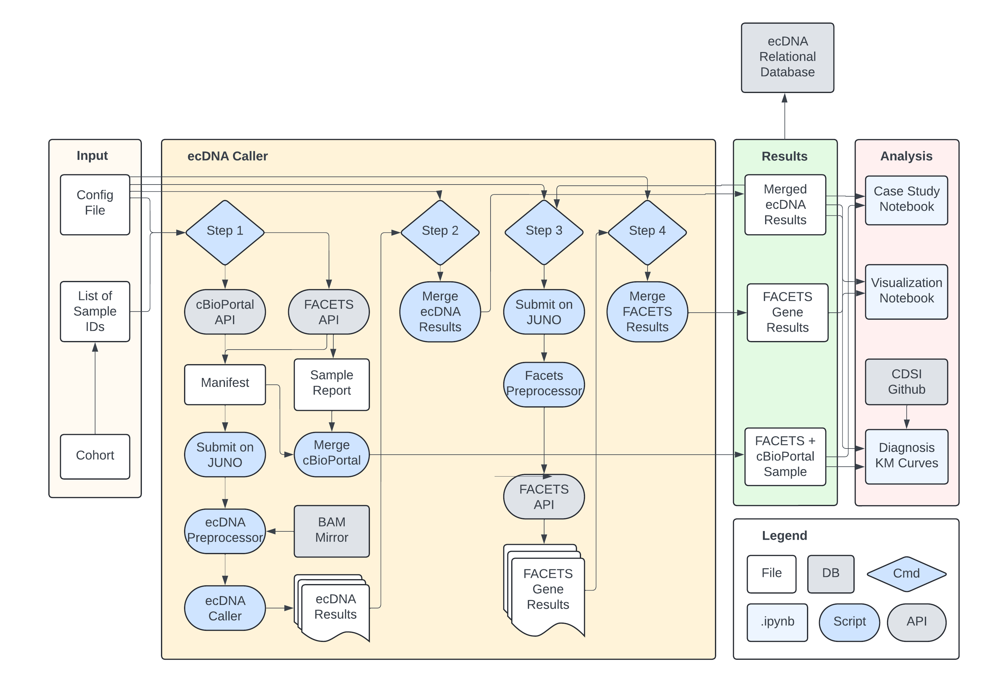

# PeNGUIN
Predicting ecDNA Novelties in Genes Using IMPACT NGS Data

A Pipeline to Analyze ecDNA in collaboration with BoundlessBio

### Workflow Overview

Below is a high-level workflow diagram summarizing the steps in the PeNGUIN ecDNA pipeline:



### Project Locations on Juno

For users running this pipeline on Juno, the main directories are:

- **Pipeline Directory (Penguin code and workflow):**  
  `/juno/cmo/bergerlab/sumans/Project_ecDNA/Production/penguin`

- **Project Resources and Legacy Code:**  
  `/juno/cmo/bergerlab/sumans/Project_ecDNA/Production`

These locations contain the full workflow, reference files, utility scripts, and older versions of the pipeline.

### Dependencies

The environment yml file for the scripts may be found in ```/envs/echo.yml```
The environment yml file for the analysis notebooks may be found in ```/envs/ecDNA_analysis.yml```

You can get all the dependencies for the scripts with 

```
conda env create --name ecDNA --file=envs/echo.yml
conda activate ecDNA
pip install git+https://github.com/mskcc/facetsAPI#facetsAPI
```

You can get all the dependencies for analysis with 

```
conda env create --name ecDNA_analysis --file=envs/ecDNA_analysis.yml
conda activate ecDNA_analysis
```

Note: You may need to ask for permission to get facetsAPI access. Please visit https://github.com/mskcc/facetsAPI and contact Adam Price if you need access.


### Step 0: Prepare Inputs and Configure the Project

For this step, you only need two things:

• A list of DMP sample IDs (one ID per line in a text file)  
• A config file

Use the global config file already provided in the parent directory:

`penguin/global_config_bash.rc`

Open this file and edit only one field:

- `projectName` – set this to whatever name you want for the run.

Once you set the projectName, all downstream outputs will automatically be created inside:

`penguin/data/projects/[projectName]`

No other changes are required in the config file unless you want to customize paths later.

### Step 1: Run the Parallelized ECHO Caller

```
cd scripts
sh generateecDNAResults.sh $config_file $list_of_samples 
```

### Step 2: Merge ECHO Results


```
sh merge_echo_results.sh $config_file
```

### Step 3 Run the Parallelized FACETS Caller

```
sh submit_facets_on_cluster.sh $config_file
```

### Step 4 Merge FACETS Results

```
sh merge_facets_results.sh ../global_config_bash.rc
```

### Step 5 Generate Final Report

```
sh generate_final_report.sh ../global_config_bash.rc
```

### Results

The final results for your run will be created automatically inside:

`penguin/data/projects/[projectName]`

If you want to directly review the final merged reports, you can find them here:

`penguin/data/projects/[projectName]/output/merged`

Additional useful folders include:

- **Logs:**  
  `penguin/data/projects/[projectName]/log`

- **Flags:**  
  `penguin/data/projects/[projectName]/flag`

- **Manifest and stats:**  
  `penguin/data/projects/[projectName]/manifest`

Each run will populate these directories based on the projectName you set in the config file.

### Visualization Notebooks

This pipeline offers several visualization notebooks in ```\notebooks``` to jumpstart analysis. 

```echo_visualize.ipynb``` is for general visualizations, analyzing ecDNA prevalence in cancer types, genes that are commonly ecDNA positive, and the effect of ecDNA on clinical factors.

```diagnosis_km_curves.ipynb``` is for creating KM curves using CDSI data. Plot curves for each cancer type and analyze cox models.

```case_study.ipynb``` is for analyzing a single gene in a single cancer. Plot copy number and segment length, cox models / KM curves for the specific gene, and analyze patient timelines.

```treatment.ipynb``` is for analyzing a treatment for a specific gene's amplification and ecDNA positivity. Plot PFS and OS KM curves, and analyze cox models. 

Each notebook has a settings section that the user should edit before each run.

To run the notebooks on Juno, first switch to the analysis environment listed in Dependencies. Run ```jupyter lab``` in the ```\notebooks``` folder. You should get a link like ```http://localhost:[NUM]/lab?token=[TOKEN]``` then in a separate window run ```ssh -N -L [NUM]:localhost:[NUM] [user]@terra```. Copy the link to a browser, and edit settings in each notebook before running.

### Helpful Links

[For cBioPortal API Information](https://docs.cbioportal.org/web-api-and-clients/)

[About Data Access Tokens](https://docs.cbioportal.org/deployment/authorization-and-authentication/authenticating-users-via-tokens/)

[FACETS API](https://github.com/mskcc/facetsAPI)

[About Boundless Bio](https://boundlessbio.com/what-we-do/)

### Troubleshooting

- You can find log files in the log directory, by default ```[dataDir]/log/log_[projectName]```. In the main directory, ```call_submit_on_cluster...``` has information on the call to submit each ECHO job. The ```echoCalls``` folder contains log files for each ECHO call. ```facets_multiple_call...``` has information on the call to submit each FACETS job. the ```facetsCalls``` folder contains log files for each FACETS gene level call. The end of each file is a date timestamp to allow for troubleshooting across multiple different runs.

- To Pull & Build singularity image on HPC:
    ```
    export singularity_cache=$HOME/.singularity/cache

    echo $singularity_cache

    singularity build --docker-login ${singularity_cache}/boundlessbio-echo-preprocessor-release-v2.3.1.img docker://boundlessbio/echo-prep

    singularity build --docker-login ${singularity_cache}/boundlessbio-ecs-v2.0.0.img  docker://boundlessbio/ecs:release-v2.0.0
    ```

- To remove chr Prefix from one of the reference files:

    ```
    sed 's/^chr//' hg19-blacklist.v2.bed > hg19-blacklist.v2_withoutPrefix.bed
    ```